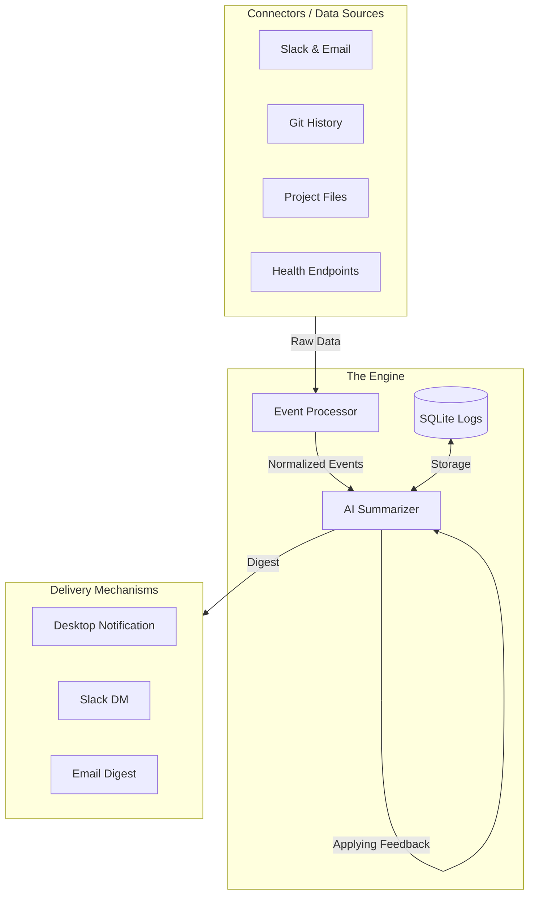

# 💓 Founder Heartbeat System

An intelligent, lightweight monitoring and summarization tool designed for **non-technical founders**. Stay informed without reading logs, dashboards, or mountains of Slack messages.

[](https://www.python.org/)
[](https://opensource.org/licenses/MIT)

## 🎯 The Problem
Founders often feel "blind" to their project's technical progress. They either spend hours in technical meetings or lose situational awareness. **Heartbeat** fixes this by translating complex technical events into 3-bullet-point executive digests.

## ✨ Key Features
- **30-Minute Check-in**: Runs automatically, checking for system activity on MacOS, Windows, and Linux.
- **AI-Powered Digests**: Uses **Claude (Anthropic)** to turn technical jargon into plain business value.
- **Full Project Mapping**: Scans any local folder (Git or no Git) to explain what a project is and how it’s structured.
- **Daily Executive Summary**: A "Big Picture" report delivered every morning at 8:00 AM for the previous day.
- **Priority Scoring**: Intelligence that flags **URGENT** or **CRITICAL** issues instantly.
- **Founder Feedback Loop**: Coach the AI directly via `feedback.txt` to adjust summarization styles.

---

## 🏗️ System Architecture

Heartbeat follows a **modular, sensor-based architecture** that prioritizes simplicity and reliable delivery.



---

### Component Overview
1. **Sensors (Connectors)**: High-performance modules that fetch data across your business stack.
2. **Event Processor**: The "Logic Center" that filters noise and assigns **Priority Scores**.
3. **AI Summarizer**: A Claude-powered engine that reads your **Feedback Loop** to speak your language.
4. **Delivery Engine**: A unified notification system that keeps you informed across any device.
5. **Persistent Storage**: Secure SQLite database used to generate the **Daily Executive Summary**.

## 🚀 Getting Started

### 1. Prerequisites
- Python 3.8+
- [Anthropic API Key](https://console.anthropic.com/)
- Slack Webhook URL (Optional)

### 2. Installation
```bash
# Clone the repository (or copy the files)
cd founder-heartbeat

# Install dependencies
pip install -r requirements.txt
```

### 3. Configuration
Rename `.env.example` to `.env` (or create one) and add your keys:
```env
SLACK_TOKEN=xoxb-...
ANTHROPIC_API_KEY=sk-ant-...
SLACK_WEBHOOK_URL=https://hooks.slack.com/services/...
```

Edit `heartbeat/config/settings.yaml` to point to your specific project paths and health endpoints.

---

## 🛠️ Usage

### Quick Test
Verify everything is working (mock mode) without waiting 30 minutes:
```bash
python test_heartbeat.py
```

### Production Run
Start the background monitoring loop:
```bash
python main.py
```

---

## 🛡️ Reliability & Security
- **Local First**: All heavy code scanning happens on your machine.
- **Active Detection**: Skips execution when you're away to save API costs and battery.
- **Safe Fallbacks**: If the AI or Slack is down, the system logs errors locally and continues monitoring.

## 🗺️ Roadmap
- [x] Cross-platform activity detection
- [x] Full codebase mapping
- [x] Daily executive summaries (8:00 AM)
- [ ] Voice command status queries
- [ ] Weekly "CEO Performance" reports

## 📄 License
Distributed under the MIT License. See `LICENSE` for more information.

---
**Made for Founders. Powered by AI.**
