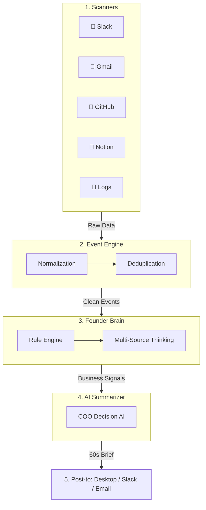

# 💓 Heartbeat Intelligence System (Master Edition)

The Heartbeat Intelligence System is a **Founder-First Decision Engine**. 
Instead of overwhelming you with raw data, it transforms noise from Slack, Gmail, Notion, and GitHub into a **60-second actionable brief** delivered every 30 minutes.

---

## 🎯 The Purpose

**The Problem:** Founders manage multiple channels (Slack, Email, Project Tools) leading to information overload and missed critical updates.

**The Solution:** An automated system that "thinks" across your apps to surface only what matters:
* 🔴 **Action Required** → Items needing immediate attention (Revenue, Clients, Blockers).
* 🟡 **For Awareness** → Updates you should know about but don't need to act on now.
* ✅ **All Clear** → Peace of mind when everything is running smoothly.

---

## 📊 Executive Sample Output

```text
🔴 ACTION REQUIRED:
- [CLIENT] Interest Intensifying: Client ABC is asking for updates on Slack and Gmail.
- [URGENT] Project Alpha deadline is at risk (Notion).
- [CRITICAL] Payment system error detected in logs.

🟡 FOR AWARENESS:
- Weekly team sync scheduled for tomorrow.
- Task "Q2 Roadmap" moved to 'In Review'.

✅ ALL CLEAR — All infrastructure systems are 100% operational.
```

---

## 🏗️ How it Works (6-Layer Master Pipeline)

This system follows a modular "Pipeline" architecture. Each layer cleans and interprets the data until it becomes a simple human decision.



### Component Breakdown
1. **Scanners (Connectors)**: Pluggable tools that "watch" your accounts (Slack, Gmail, etc).
2. **Normalization Layer**: Converts everything (an email, a task, a log) into a standard "Event" format.
3. **Deduplication Layer**: Smart logic that ensures the same update doesn't appear twice.
4. **Founder Brain (Intelligence)**: Uses **business-level rules** and **keyword-scoring** to calculate urgency.
5. **AI Summarizer (COO)**: Acts as your AI Chief of Staff. It reads the signals and writes the 🔴/🟡/✅ brief.
6. **Delivery Layer**: Routes the summary to your preferred channel (Desktop, Email, or Slack).

---

## ✨ Key "Master" Features
* **Multi-Source Thinking**: If the same client mentions a problem on Slack AND Email, the system escalates it automatically.
* **Score-based Priority**: Uses a risk-scoring engine (0-10) to determine what actually deserves your attention.
* **Graceful Failure**: If One source (e.g. Gmail) fails, the system still generates a digest from everything else.
* **Mobile-Ready**: HTML Email delivery and Slack Webhooks ensure you're updated anywhere.

---

## 🚀 Usage

### For the Founder (Quick Demo)
To see the system in action with realistic mock data, run:
```bash
python demo_run.py
```

### For Continuous Monitoring
To start the 30-minute automated loop, run:
```bash
python heartbeat.py
```

---

## 🛠️ Tech Stack
* **Python**: Core logic and intelligence.
* **AI Engine**: Gemini (Free Tier), Claude, or GPT-4o.
* **Database**: SQLite (No setup required).
* **Connectors**: Slack API, Gmail API, GitHub API, Notion API.

---

> 🔗 [github.com/sid0803/heartbeat-system](https://github.com/sid0803/heartbeat-system) · **Made for Founders. Built by AI.**
